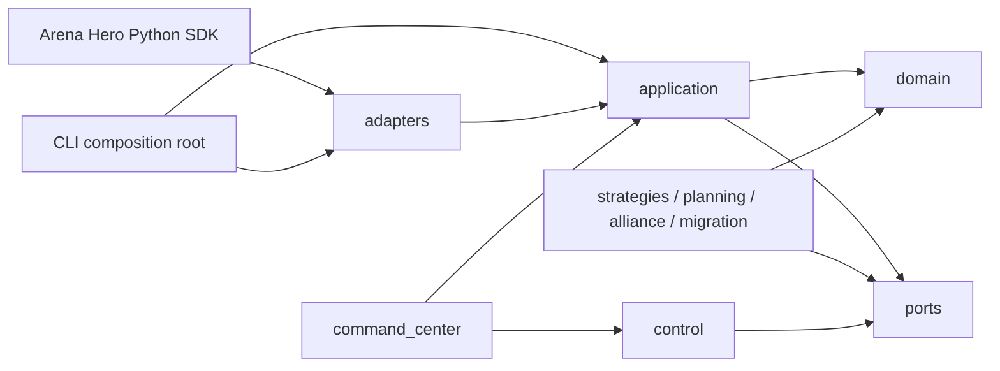

# Architecture

Arena Hero Agent uses a ports-and-adapters architecture. The goal is to keep deterministic decisions
independent from SDK clients, persistence, process supervision, and web frameworks.

## Dependency model

### Layers

- `domain`: immutable value objects, invariants, actions, observations, and reducers;
- `ports`: interfaces owned by the application for clocks, SDK access, storage, leases, commands,
  telemetry, and health;
- `application`: turn handling, decision orchestration, deadlines, repair, and use cases;
- `strategies` and `planning`: deterministic candidate generation and assignment logic;
- `alliance` and `migration`: versioned cross-tenant coordination and restart-safe state machines;
- `control`: tenant lifecycle, director services, lease fencing, readiness, and recovery;
- `adapters`: concrete SDK, filesystem, SQLite, subprocess, and HTTP integrations;
- `command_center`: API routes, services, projections, and bounded event streams;
- `cli`: process composition and user-facing entry points.

## State ownership

One tenant runtime owns one mutable tenant partition. A durable write or game submission requires a
lease with a fencing token. A director may consume versioned snapshots and publish commands carrying
an identifier, tenant, issue time, expiry, expected generation, and idempotency key. The receiving
tenant validates and applies or rejects the command; the director never writes tenant state.

Command Center read paths consume projections. Write paths call control ports and audit accepted,
rejected, expired, duplicate, and unauthorized commands.

## Replaceable ports

Initial implementation batches define interfaces for:

- clock and deadline budgets;
- game turns and submissions;
- tenant state and event journals;
- lease acquisition and fencing;
- decision recording and telemetry;
- snapshot reads and director commands;
- health and readiness.

Concrete implementation details remain in adapters and can be replaced without changing domain
logic.

## Migration and compatibility

The legacy TypeScript implementation is treated as a behavioral oracle, not as a source tree to
translate line by line. Each behavior slice is migrated with recorded observation/decision/result
fixtures, canonical serialization, an explicit allowed-difference registry, and fault injection.
Unknown or unsupported differences remain visible and cannot be counted as matches.
