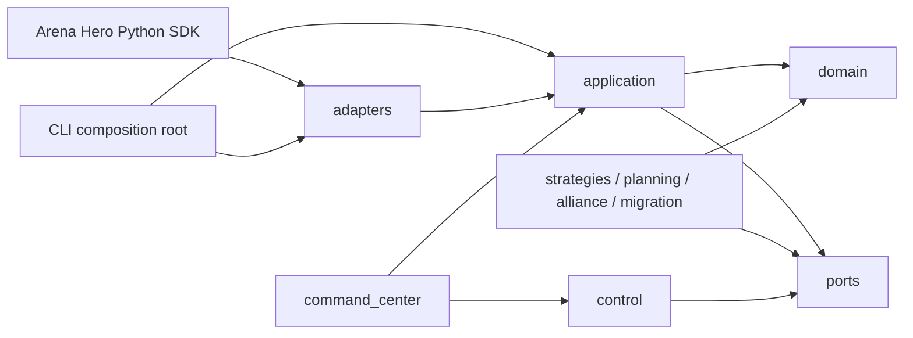

# Architecture

Arena Hero Agent uses a ports-and-adapters architecture. The goal is to keep deterministic decisions
independent from SDK clients, persistence, process supervision, and web frameworks.

## Dependency model

### Layers

- `domain`: immutable value objects, invariants, actions, observations, and reducers;
- `ports`: interfaces owned by the application for clocks, SDK access, storage, leases, commands,
  telemetry, and health;
- `application`: turn handling, decision orchestration, deadlines, repair, and use cases;
- `strategies` and `planning`: deterministic candidate generation and assignment logic;
- `alliance` and `migration`: versioned cross-tenant coordination and restart-safe state machines;
- `control`: tenant lifecycle, director services, lease fencing, readiness, and recovery;
- `adapters`: concrete SDK, filesystem, SQLite, subprocess, and HTTP integrations;
- `command_center`: API routes, services, projections, and bounded event streams;
- `cli`: process composition and user-facing entry points.

## State ownership

One tenant runtime owns one mutable tenant partition. A durable write or game submission requires a
lease with a fencing token. A director may consume versioned snapshots and publish commands carrying
an identifier, tenant, issue time, expiry, expected generation, and idempotency key. The receiving
tenant validates and applies or rejects the command; the director never writes tenant state.

Command Center read paths consume projections. Write paths call control ports and audit accepted,
rejected, expired, duplicate, and unauthorized commands.

## Replaceable ports

Initial implementation batches define interfaces for:

- clock and deadline budgets;
- game turns and submissions;
- tenant state and event journals;
- lease acquisition and fencing;
- decision recording and telemetry;
- snapshot reads and director commands;
- health and readiness.

Concrete implementation details remain in adapters and can be replaced without changing domain
logic.

## Migration and compatibility

The legacy TypeScript implementation is treated as a behavioral oracle, not as a source tree to
translate line by line. Each behavior slice is migrated with recorded observation/decision/result
fixtures, canonical serialization, an explicit allowed-difference registry, and fault injection.
Unknown or unsupported differences remain visible and cannot be counted as matches.
## Runtime constraints and fault boundaries

The live writer is a single asyncio task: one tenant, one tick loop, one decision and one
submission per tick, strictly serialized by an explicit per-tick deadline budget. There is no
worker pool, queue, or parallel candidate path in the decision pipeline, so classic
"workers pile up at the core" deadlocks and unbounded submission queues cannot arise by
construction. Determinism and bounded resource use are deliberately chosen over parallelism.

- **Decisions must be synchronous, fast, pure functions.** The event loop is single-threaded; a
  slow synchronous `decide` would stall every await in the process, including lease renewal.
  The 100ms tick budget bounds `decide`; a decision that exceeds it records
  `selection_timeout` and (live) the loop continues (`continue_on_selection_timeout`).
- **Submissions have a loop-level guardrail.** The SDK client has its own 5s request timeout,
  but a hung connection must never stall the loop forever: `submit_timeout_seconds` (live path:
  10s = 2x SDK timeout) awaits the injected submit under a wall-clock bound and records a
  rejected outcome (`submit timed out`) that obeys `submit_error_policy`. A submit that already
  completed records its actual outcome because an in-flight submission cannot be retracted.
- **Observer side effects never affect decisions.** Recorder and telemetry failures are
  swallowed and only mark their component unhealthy; telemetry is never readiness-affecting.
  Critical recorder or source failures surface as degraded / not ready.
- **A clean stream end is reopenable (live).** The SDK returns on websocket close code 1000
  without reconnecting; `continue_on_stream_ended` reopens the source (bounded by
  `max_reconnects`) so session rotation does not end the writer.
- **`decide` / `submit` exceptions are fail-closed.** A non-SDK exception propagates and stops
  the run; it is never silently replaced by a fallback decision. SDK submission failures are
  translated into rejected outcomes by the adapter and stay inside the loop vocabulary.

### Why no external agent framework (decision record, 2026-08-12)

The Python agent is intentionally not built on SWE-agent, LangGraph, CrewAI, OpenAI Agents,
Claude Code, or any other external agent framework. The arena decision surface is a
deterministic, real-time tick loop (one decision per ~15s game tick, 100ms budget), not a
multi-step LLM tool-calling loop; external frameworks target open-ended multi-step reasoning
and would add dependency, latency, and nondeterminism without matching the game contract. The
behavioral oracle is the legacy TypeScript implementation, and the reference for correctness is
fixture/differential comparison against it. If future work introduces slow reasoning (LLM
planners, heavy search), it must live behind a separate bounded worker boundary with explicit
budgets — never inside the synchronous `decide` path — and that decision should be revisited
then.

